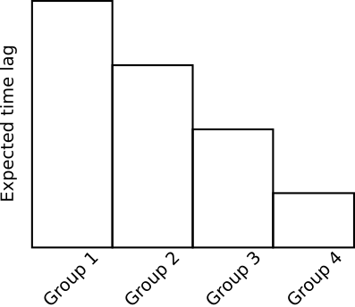
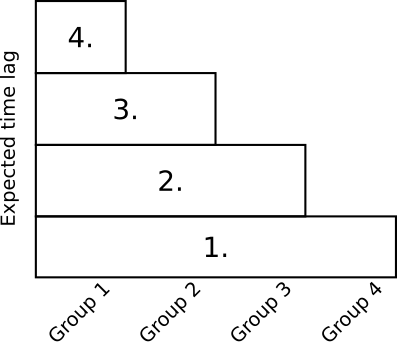
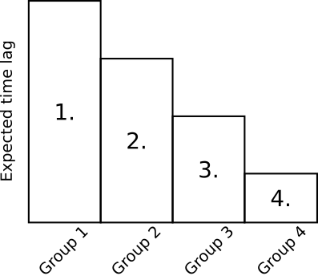
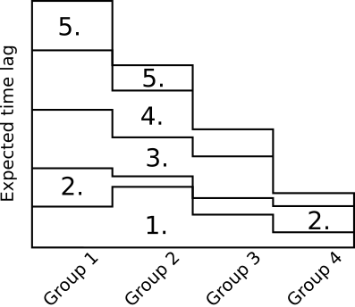
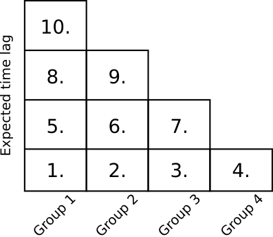

# Optimal time lag discovery

As old prophets foretold, optimal time lag needed to be found. Thus we set our sights on new horizons, on which time meant just a number. And we could set out free, for the shackles of past have fallen.

## Chapter One - the plan
There were numerous features, for which the time lag was needed to be found. Score and one, to be exact. Possibly, score and two if one chose to provide the present results for the future. Since this is not a small number and process of search sure is heavy for the machine, it was only fair to simplify the task using some educated guesses. 

For that, following assumptions was deemed to be safe to made:
1. The feature columns were sorted and grouped in a way that in each group were features that should have the same time lag. For example, the 'Flotation Column 01 Air Flow' was made to neighbour with a 'Flotation Column 01 Level' feature, as there is a high chance of time lag being shared between them.

2. Each time lag needed to be evaluated in some way. "The way" being an attempt to make a PLS model, fit it and evaluate the results on validation set. Here, another problem lurks. How many components should we let the PLS model to have? In order to make a fair evaluating grounds for all model, it was decided that each PLS model will be judged in its fullness, meaning with all the components. While it does not provide us with a good model straight away, it most likely can provide us with good enough estimate to find the Holy Grail - the optimal time lag.


With the simplified task at hand, we could focus on a more pressing question. How to actually estimate the optimal time lag? Being the optimization task in nature, we needed to find the most reliable way that would give us what we needed. But the way lay in the unknown, in the Terra Incognita if you will. And thus a new search begin, for a way that will lead us to the path of glory.


## Chapter Two - where is the path
So we grouped the parameter and ordered them in a way of a group with a biggest expected time lag being in the front and with a smallest expected time lag being at the end. The groups are following:

Group 1: ``"% Iron Feed", "% Silica Feed", "Starch Flow", "Amina Flow", "Ore Pulp Flow", "Ore Pulp pH", "Ore Pulp Density"``\
Group 2: ``"Flotation Column 01 Air Flow", "Flotation Column 01 Level"``\
Group 3: ``"Flotation Column 02 Air Flow", "Flotation Column 02 Level"``\
Group 4: ``"Flotation Column 03 Air Flow", "Flotation Column 03 Level"``\
Group 5: ``"Flotation Column 04 Air Flow", "Flotation Column 04 Level"``\
Group 6: ``"Flotation Column 05 Air Flow", "Flotation Column 05 Level"``\
Group 7: ``"Flotation Column 06 Air Flow", "Flotation Column 06 Level"``\
Group 8: ``"Flotation Column 07 Air Flow", "Flotation Column 07 Level"``\
Group 9: ``"Silica content from the past"``

This way, the expected time lag would go from highest to the lowest, making "stairs" in a way.



Now, a lot of trial and error have been involved. Alhough mostly errors.

### The horizontal stairs method
First approach we tried was to estimate the "widest stair" at the bottom first, then one above and so on.
 


This did not lead to a correct result, as the first stair would be estimated to be much higher due to all stairs above it that would pull it higher. As we realized it, we quickly abandoned pursuit of this approach and focused on others, where we hoped our struggle would not be in vain.

### The vertical stairs method
As we put our genius together, we forged an idea of flipping the stairs.
 


Our hopes of success were crushed quickly, as we saw what came from this forsaken path. The results were not good probably because some of the features do not influence the prediction in any way, and also the model can rely on some variables more depending on the currently estimated lag. Even though this algorithm converged in something, the performance was so bad that we left in hope of better tomorrows.


### The "let's do everything at once" method
Because first two methods turned out to be insufficient, we realized that we need to tie the lag estimation for each group with others in some way. If we take one group at a time, it is not good. So what if we take all at once? We devised a method that is much more complicated than it needed to be. The idea was like this:

```
while not converged:
    for each group:
        try to modify a lag by some step in some direction (increase/decrease)
        make a model with this lag
        evaluate the performance

    see which groups altered the performance the most
    modify time lag of all groups scaled by their impact on the model
```

So the image of stair building would look like this:



This approach showed some improvements, although it had tendency of oscillating instead of converging. After a while, we abandoned this pursuit as well, but with knowledge that we used in making of our Magnum Opus. The actually working algorithm.


### The "how about taking it slow" method
We saw that highlighting cross-group dependencies improved the algorithm. The oscillations from previous algorithm were probably caused by modifying the lags too fast, so we resorted in doing the similar thing, just one step and variable at the time.


```
initialize direction vector
while not converged:
    for each group:
        try to modify a lag by some step in direction given by element of direction vector
        make a model with this lag
        evaluate the performance
        if the performance improved:
            add step to the final lag for this group
        else:
            switch direction element belonging to this group in direction vector
```

And we hit the gold. The algorithm reliably converged to a local minimum. We say local minimum because the algorithm could converge to other values based on starting lag values. Curiously enough, the best model was reached when the starting value was 0 for all groups.


## Chapter Three - the path
We found a way to estimate the best lag given starting assumptions and boundaries. Now it meant only following the results and looking back on all dumb things we made along the way. It is important to mention that results of the first algorithms could be (were) incorrect, because as we were developing new methods we often found mistakes that meant that previous approach would not work, even if it could. But that is a process of learning I guess. We reached our milestone despite all the blood and pain, we persevered, and that is why we succeeded. (copium)
